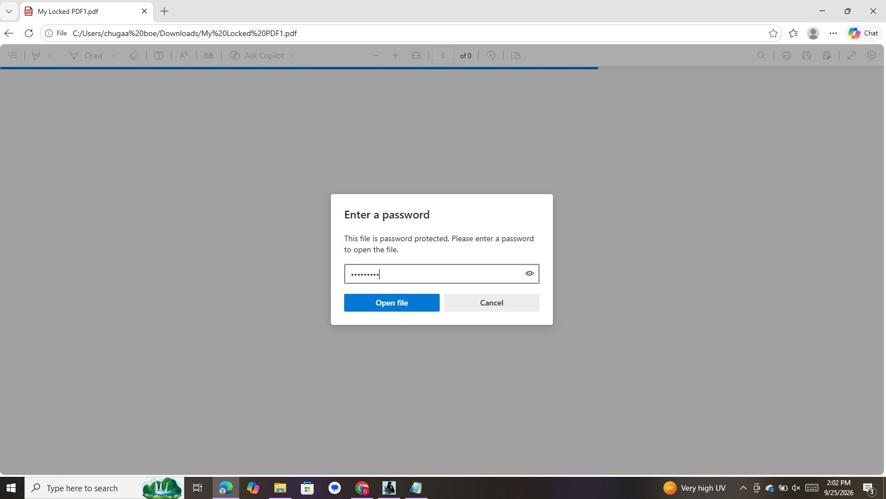
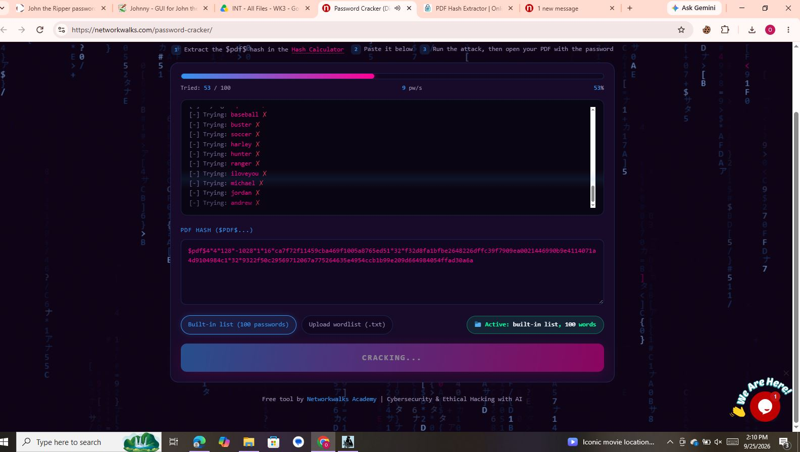
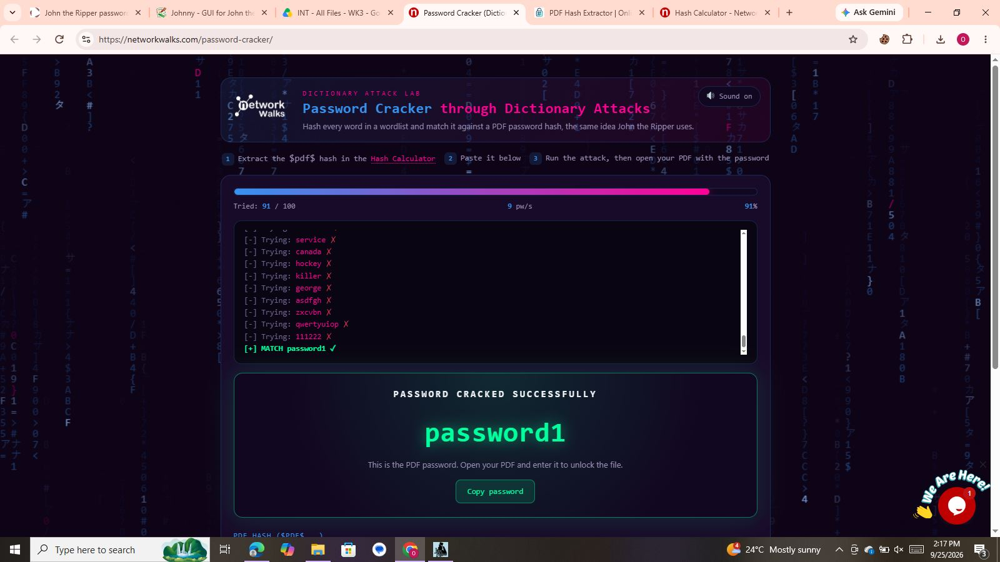

# 🔐 Week 3 Cybersecurity Project
## Password Cracking with John the Ripper & NETWORKWALKS Tools

---

## 📌 Project Overview

This repository contains my **Week 3 Cybersecurity & Ethical Hacking projects** completed as part of the **NETWORKWALKS Cybersecurity & Ethical Hacking Internship Program**.

Week 3 focused on **password cracking, password recovery, hashing, and password security assessment** through controlled and authorized laboratory exercises.

The week consisted of two practical project modules:

# 🧪 PROJECT MODULE 1
# Password Cracking with John the Ripper

## 📖 Overview

John the Ripper (JTR) is a password cracking and password security auditing tool used by security professionals to assess password strength.

In this practical exercise, **John the Ripper** and **Johnny GUI** were used to recover the password of an intentionally protected PDF file within the authorized training environment.

The project also involved extracting the password hash from the PDF and preparing the hash for password recovery.

---

## 🛠️ Tools Used

| Tool | Purpose |
|---|---|
| John the Ripper | Password recovery and security testing |
| Johnny GUI | Graphical interface for John the Ripper |
| PDF Hash Extractor | Extracting the PDF password hash |
| Windows PC | Laboratory environment |
| Protected PDF | File used for the authorized exercise |

# 🔐 Week 3 | Project Module 2
# Password Cracking with NETWORKWALKS Tools

## 📌 Project Overview

This project is part of **Week 3** of the NETWORKWALKS Cybersecurity & Ethical Hacking Internship Program.

The project focuses on understanding **password cracking and password security** through a controlled laboratory exercise.

In this module, I used two browser-based NETWORKWALKS tools:

- **NETWORKWALKS Hash Calculator**
- **NETWORKWALKS Password Cracker**

The objective was to recover the password of an intentionally protected PDF file and verify the recovered password by successfully opening the PDF.

---

# 🎯 Project Objective

The main objective of this practical exercise was to:

- Understand how password-protected files are handled.
- Extract a password hash from a protected PDF.
- Understand the role of hashes in password security.
- Use the NETWORKWALKS Hash Calculator.
- Use the NETWORKWALKS Password Cracker.
- Perform a controlled password recovery exercise.
- Verify the recovered password by opening the protected PDF.

---

# 🛠️ Tools Used

| Tool | Purpose |
|---|---|
| NETWORKWALKS Hash Calculator | Extract the password hash from the protected PDF |
| NETWORKWALKS Password Cracker | Perform password recovery |
| Web Browser | Access the online tools |
| Windows PC | Laboratory environment |
| Protected PDF | File used for the authorized exercise |

## 🔄 EVIDENCES

